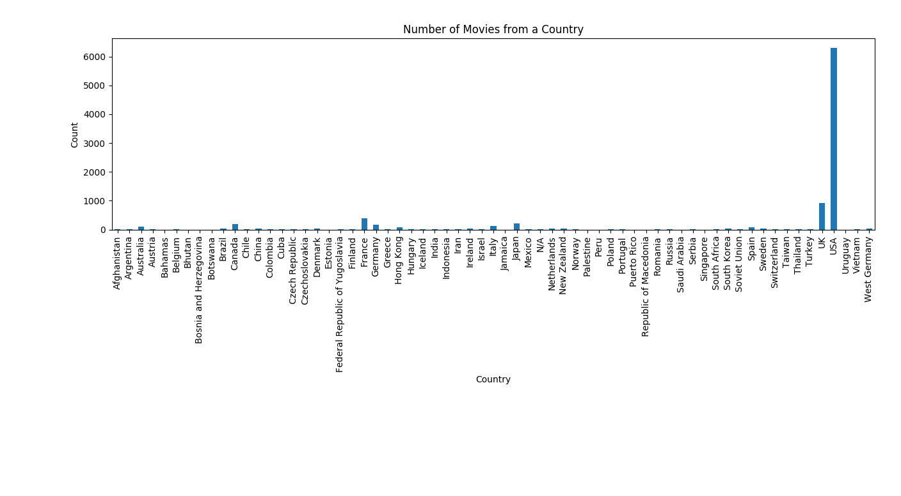

# international-movies-ml
Machine learning to recommend movies from around the world!

One of the potential dangers in recommender systems is also what they are meant to do- recommend you things that you will continue to like. This can lead people to continue liking things they already like with nothing that would inspire them to try something out of their comfort zone. Branching out can lead to diversity in thinking as well as increased empathy. Therefore, the goal of this project is to deliberately use a user's preference to recommend them movies from another country. The user will be able to choose a country, then the recommender will use their preferences to recommend a movie for them from that country. This project was partly inspired by [Book Riot's list of 80 books from the 80 most populated countries in the world](http://bookriot.com/2016/04/28/around-world-80-books-global-reading-list/ "book riot list").

## Jupyter Notebook
A compilation of most of the code in this repository is in International Movie Recommender.ipynb, a Jupyter notebook. This can be read in GitHub or using [NBViewer](). The notebook provides a lot more explanation than the code does and walks through how I gathered country data, the different types of recommenders/machine learning alogirithms I looked at, and how I implemented each of them.

## Jupyter slides
A zip file of my presentation can be found in `presentation_with_internet.zip` as well as in `presentation_wo_internet.zip`. `presentation_with_internet.zip` is a smaller file overall since it does not include the [Requests.js]() library (it uses a CDN, so when loading it will need to access the internet in order for the slides to load correctly). `presentation_wo_internet.zip` can be viewed without internet- it includes a copy of the Requests.js library within the zip file. The slides can be stepped through with the left, right, up, and down arrows, as denoted by the arrow panel in the bottom right hand corner. You can also press ESC to view the slide deck as a whole. For the most part, this is a reformatted version of the Jupyter Notebook International Movie Recommender.ipynb. international_movie_recommender_slides.ipynb is the notebook that contains the metadata to generate these slides.

## scripts
Folder for some helper scripts in order to gather initial data.

### getCountryData.py
This script uses the [requests](http://docs.python-requests.org/en/master/ "requests homepage") library to issue http requests to the OMDb API in order to find out further information about a given movie. The script runs through a list of movies (for example, MovieLens's links.csv), finds the IMDB ID, then looks up the movie through OMDb. From there, it finds the country associated with the movie and creates a new CSV that appends country data to the already existing movie data. 

When running on a very large dataset (i.e. Movielens's 20 million ratings set), the http requests can often return a connection error due to too many requests. When the script gets a connection error, it sleeps for five seconds, then tries again. So far, this has always worked to successfully complete the http request. Sometimes, the returned JSON will be malformed, though it is not consistently on the same http request that this happens. If there is an error, then the script will fill in 'JSONERROR' under the country name and the user should go back and manually fill in the country. In the 100k dataset, this problem did not come up at all, however in the 20m dataset, it occurred 4 times. 

### getCountryStats.py
This script creates a csv with three columns- country, number of movies, and number of primary movies. The country is the country associated with a movie, the number of movies is how many movies in the dataset are associated with the country, and the number of primary movies is how many movies list that country as its first country. This script takes in the output of `getCountryData.py`

### getCountryStatsPandas.py
This script was an early attempt at learning to use [pandas](http://pandas.pydata.org/ "pandas homepage") to read and write CSV files, as well as to manipulate the data. Its output is the same as getCountryStats.py, though it also outputs a plot of how many times a country is associated with a movie in the dataset. The output plot should look like: 

## recommenders

### popularityRecommenderGraphlab.py
A simple popularity recommender using [GraphLab](https://turi.com/ "graphlab homepage"), mostly based on [this tutorial](https://www.analyticsvidhya.com/blog/2016/06/quick-guide-build-recommendation-engine-python/ "tutorial"). This will always recommend the same movies for every user since there is no personalitzation- it is just recommending the most popular movies. This script uses 80% of the ratings.csv data and filters out the country the user is interested in. The script then recommends the top five movies from that country based on popularity.

### popularityRecommender.py
Produces the same results as `popularityRecommenderGraphlab.py` but does not use the Graphlab library, only the pandas one.

